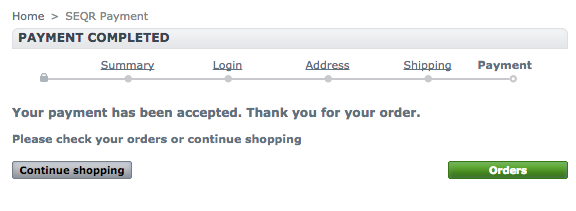

SEQR Prestashop plugin
======================

# SEQR #
SEQR is Sweden’s and Europe’s most used mobile wallet in stores and online. SEQR enables anybody with a smartphone to pay in stores online and in-app.
Users can also transfer money at no charge, store receipts digitally and receive offers and promotions directly through one mobile app.

SEQR offer the merchant 50% in reduction to payment card interchange and no capital investment requirements.
SEQR as method of payment is also completely independent of PCI and traditional card networks.

SEQR is based on Seamless’ technology, a mobile phone payment and transaction service using QR codes & NFC on the front-end and Seamless’ proven transaction server on the back-end.
SEQR is the only fully-integrated mobile phone payment solution handling the entire transaction chain, from customer through to settlement.
Through our state of the art technology, we have created the easiest, secure, and most cost effective payment system.

Learn more about SEQR on www.seqr.com

## Supported Prestashop versions: ##
* >= 1.6.x
* 1.5.x

## Dowloads ##
* Version 1.1.0: [seqr-ps-plugin-1.1.0.zip](build/seqr-ps-plugin-1.1.0.zip)
* all versions: [builds](build/)

# Plugin #
Plugin provide possibility for shop clients to select SEQR as payment method, and after order placement pay it via scanning QR code (or directly from your mobile device).

* SEQR as payment method on checkout page.

* SEQR payment summary.

* Payment via scanning of QR code.

* Payment confirmation

## Installation & Configuration ##

Plugin can be installed via installation in administration or by copping all plugin files to the "modules" directory.

### Installation using administration page ###

1. Please download a build package from: [builds](build/)
2. Open Prestashop administration page, go to "Modules" and on the top right corner choose "Add a new module".
3. Select the downloaded package and confirm by clicking "Upload this module".
4. Find the module on the module list and install it.
5. Provide valid configuration values.

### Configuration ###

Plugin configuration properties are available on the module configuration page.

Contact Seamless on integrations@seamless.se to get the right settings for the SOAP url, Terminal ID and Terminal Password.

Default timeout is set to 120 seconds.

All properties are required and should be configured before enabling this payment method in production.

## Development & File structure ##

Plugin based on javascript plugin for SEQR integration.

Please check it for understanding how work web component http://github.com/SeamlessDistribution/seqr-webshop-plugin.
For more information about SEQR API please check http://developer.seqr.com/merchant/webshop/

### Plugin directories and files: ###
* controllers - front controllers used in the payment process
* css - styles definition for the plugin
* img - images
* js - scripts required by the plugin
* lib - the SEQR e-commerce library and its Prestashop implementation
* views - view definitions for the payment process
* seqr.php - module entry point

### Major php classes ###
* _seqr/seqr.php_ - an entry point of the module, provides information about module, administration form, the installation and remove module procedures.
* _seqr/prestashop/PsConfig.php_ - defines configuration for the Prestashop platform, installation, uninstall definitions.
* _seqr/prestashop/PsFactory.php_ - defines conversion from Prestashop order to the unified invoice representation.
* _seqr/prestashop/PsSeqrService.php_ - defines logic, sends requests to the SEQR system via provided API (seqr/lib/api/SeqrApi.php)

